# 임대형기숙사 적합 필지 탐색 · 성북구

서울 성북구 **52,970개 필지**를 개별공시지가 대비 사업성으로 평가하고,
파라미터를 직접 조정하며 후보를 탐색할 수 있는 웹 지도입니다.

**🔗 [지도 열기](https://cho-woojin.github.io/dormitory-site-selection/)**

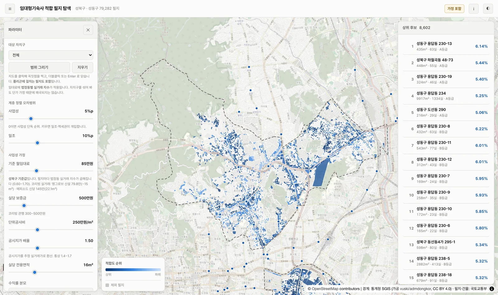

---

## 무엇을 푸는가

임대형기숙사(건축법 시행령 별표1 제2호 라목, 2023년 신설된 준주택)를 지을 땅을 고를 때,
"어느 필지가 좋은가"는 하나의 숫자로 답할 수 없습니다. 사업성이 좋은 땅은 대개 외곽에
있고, 역세권은 땅값이 비싸며 건물이 빽빽해 일조가 나쁩니다.

실제로 성북구 데이터에서 세 지표는 서로 반대 방향을 가리킵니다.

| 역세권 등급 | 수익률 중위 | 일조 개방도 중위 |
|---|---|---|
| A (250m 이내) | 3.75% | 0.596 |
| E (1km 초과) | 4.35% | 0.655 |

상관계수는 모두 `|r| < 0.2`로 약합니다. 세 지표가 **각자 독립적인 정보**를 담고 있다는 뜻이고,
그래서 가중 평균으로 뭉개면 안 됩니다.

## 탐색 방식: 오차범위 계층 정렬

가중합이 아니라 **우선순위가 있는 3단계 정렬**입니다.

```
1순위  사업성 (공시지가 대비 수익률)
  └ 오차범위 tol₁ 안에서 동급 취급
      2순위  일조환경 (남측 인접 건물 차폐 + 접도 보너스)
        └ 오차범위 tol₂ 안에서 동급 취급
            3순위  역세권 등급 (250 / 500 / 750 / 1,000m 계단식)
              └ 동급이면 사업성 원값으로 최종 정렬
```

**오차범위 자체가 사용자가 조정하는 핵심 파라미터입니다.**
`tol₁ = 0`이면 순수 사업성 순위가 되고, 키우면 일조와 역세권이 순위를 지배합니다.

| tol₁ | 상위 200 중 순수 사업성 순위와 겹치는 수 |
|---|---|
| 0 | 200 (일조·역세권 무시) |
| 2 | 196 |
| **5 (기본값)** | **165** |
| 10 | 86 |
| 20 | 51 (사업성이 거의 무의미해짐) |

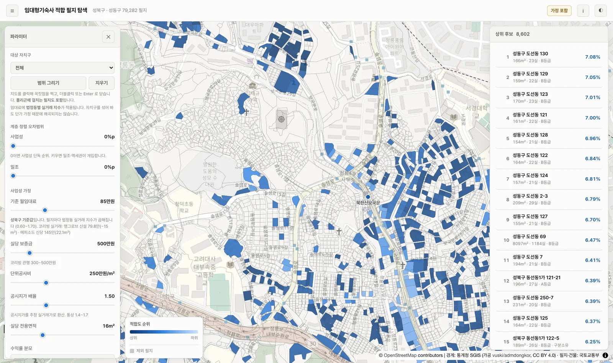

*`tol = 0`. 사업성만으로 정렬한 결과.*

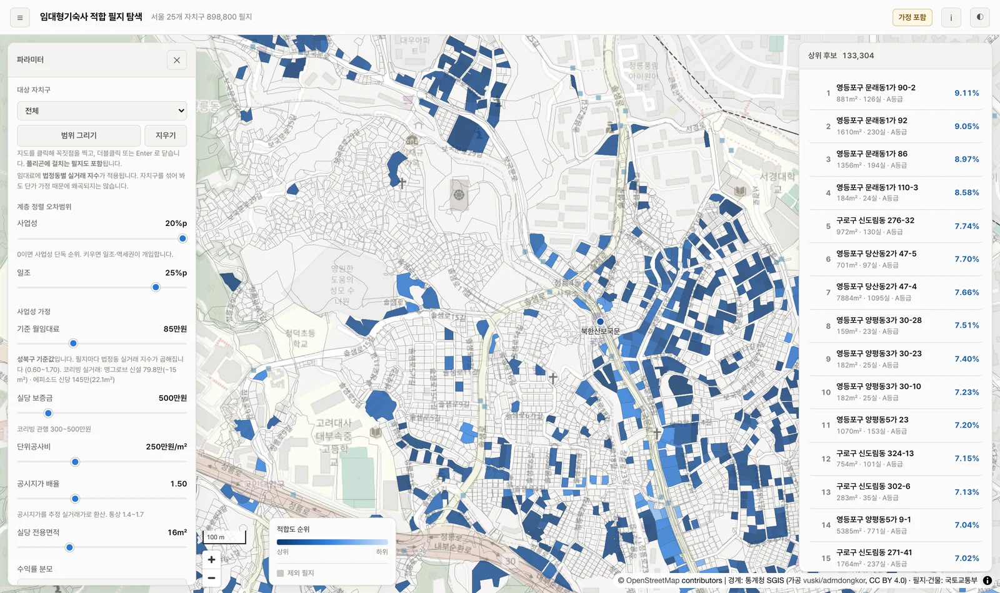

*`tol₁ = 20`. 사업성 상위권 안에서 일조와 역세권이 순위를 재배열합니다.*

---

## 결과 요약

```
성북구 전체            52,970 필지
  지목 '대'            40,602
  용도지역 공동주택 가능   38,958
  토지이용상황 적격       35,649
  접도 가능             27,857
  20실 이상 규모   →     4,894 후보  (9.2%)
```

**20실 규모 필터가 전체의 80%를 걸러냅니다.** 성북구가 소필지 저층주거지라는 구조적 특성이며,
그래서 최소 실 수와 실당 면적이 결과를 좌우합니다. 둘 다 웹에서 조정할 수 있습니다.

후보 4,894필지의 순투자금 기준 중위 수익률은 **3.9%** (5~95%: 2.7~4.9%),
사업비 중위 41억원, 27실 규모입니다.

### 정릉동 사례

정릉동은 10,304필지 중 900개가 후보로 남고, 그중 **79개가 성북구 상위 200위 안**에 듭니다.

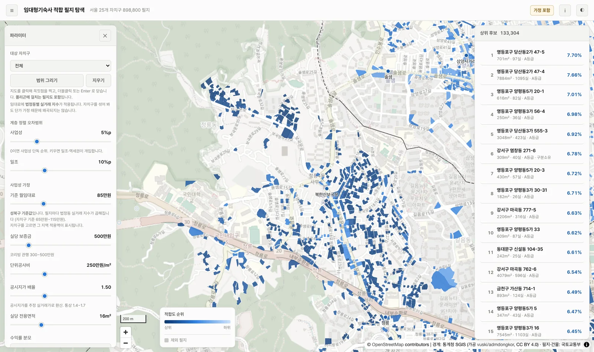

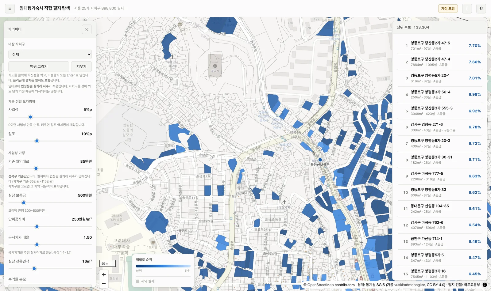

*짙을수록 상위. 필지 하나하나가 개별 평가 단위입니다.*

필지를 클릭하면 순위 근거와 사업 구조가 그대로 열립니다.

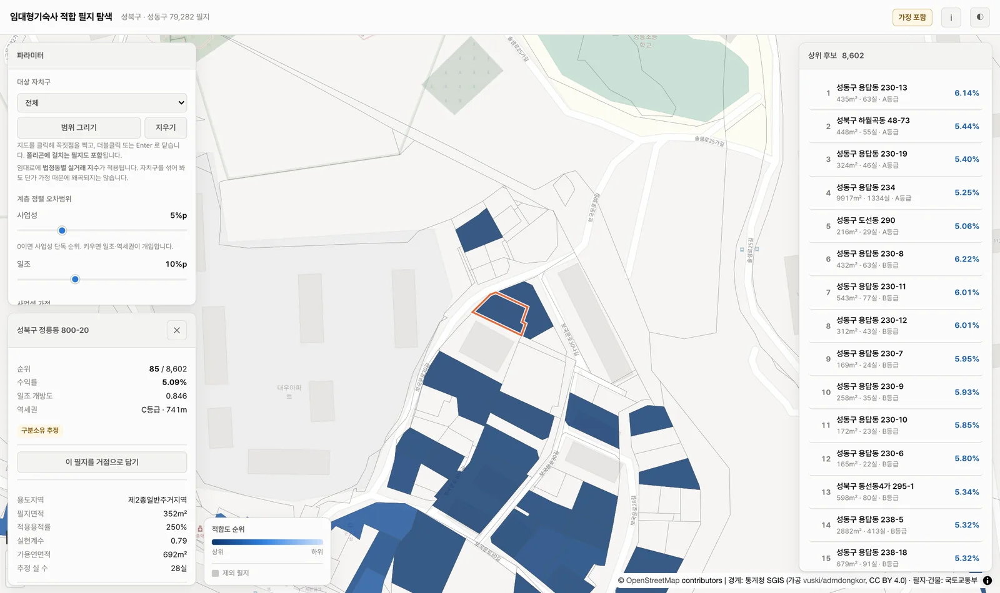

---

## 지표 정의

### S₁ 사업성

```
토지비       = 개별공시지가 × 필지면적 × 실거래배율
가용연면적    = 필지면적 × 적용용적률 × 실현계수
실 수        = floor(가용연면적 × 전용률 / 실당면적)
총사업비      = 토지비 + 공사비 + 철거비
순투자금      = 총사업비 - 보증금총액

S₁ = NOI / 순투자금
```

보증금은 무이자 조달자금이므로 비용이 아니라 분모에서 차감합니다.
분모는 총사업비 기준, 토지비 기준으로도 전환할 수 있습니다.

**적용용적률**은 서울특별시 도시계획 조례 제48조를 따르되 두 가지를 반영합니다.

- 2025-05-19 ~ 2028-05-18 소규모 건축물 **한시 완화** (2종일반 200→250%, 3종일반 250→300%)
- 상업지역 **주거용 용적률 400% 상한** (조례 별표). 임대형기숙사는 준주택이라 주거용입니다.

> 400% 상한을 빠뜨렸을 때는 상위 200필지 중 **199개가 상업지역**이었습니다.
> 용적률과 수익률의 상관이 +0.43으로, 사업성이 아니라 용적률이 순위를 만들고 있었습니다.
> 상한을 적용하자 상관이 +0.01로 떨어지고 공시지가 상관이 -0.74가 되었습니다.
> "공시지가 대비 사업성"을 재는 지표라면 땅값이 순위를 만드는 쪽이 맞습니다.

**실현계수**는 상수가 아니라 토지특성정보의 필지 형상과 지형 실측값에서 유도합니다
(정방형 1.00 ~ 자루형 0.75, 평지 1.00 ~ 급경사 0.85). 실측 분포는 중위 0.83입니다.

### S₂ 일조환경

서울의 **동지 정오 태양고도 28.97°**를 기준으로, 필지 대표점에서 남측 135~225°를
15° 섹터로 나눠 각 섹터의 최대 앙각을 구하고 개방도를 계산합니다.

도로에 면한 방향은 영구히 열려 있으므로 접도 보너스를 더합니다.
옆 필지에는 언제든 건물이 올라가지만 도로에는 그럴 수 없기 때문입니다.

검증: 접도 등급별 개방도가 **보너스를 빼고도** 단조 증가합니다.
순서를 보너스가 만든 게 아니라 실제 건물 배치가 만든다는 뜻입니다.

| 도로측면 | 보너스 전 | 최종 |
|---|---|---|
| 광대소각 | 0.854 | 0.960 |
| 중로각지 | 0.651 | 0.732 |
| 소로한면 | 0.541 | 0.563 |
| 세로각지(가) | 0.536 | 0.559 |

극단 표본도 상식과 맞습니다. 개방 상위는 성북동 저밀 단독주택지,
차폐 하위는 동선동·보문동 역세권 밀집 상업지입니다.

### S₃ 역세권 등급

성북구 및 경계 버퍼 1.5km 내 **48개 지점**까지의 직선거리를 A~E 등급으로 나눕니다.
임계값 4개 모두 웹에서 조정 가능합니다.

---

## 하드 필터와 경고 표시

건축 자체가 불가능하거나 매입이 불가능한 필지는 순위에서 제외합니다.

| 코드 | 조건 | 판정 근거 |
|---|---|---|
| F6 | 지목이 '대'가 아님 | 토지특성정보 `A11` |
| F1 | 용도지역에서 공동주택 불가 | `A14` |
| F3 | 아파트·연립·공원·도로·하천 등 | `A18` |
| F4 | 맹지 또는 자동차 통행 불가 | `A24` (`세로한면(불)` 등) |
| F5 | 20실 미만 | 건축법상 임대형기숙사 요건 |

제외하지 않고 **표시만** 하는 항목도 있습니다.

- **구분소유 추정 (다세대)** 1,141건. 전 세대 동의가 필요해 난이도가 높지만 법적 불가는 아닙니다.
- **용도지역 걸침** 301건. 두 용도지역에 걸친 필지로, 넓은 쪽을 채택했습니다.

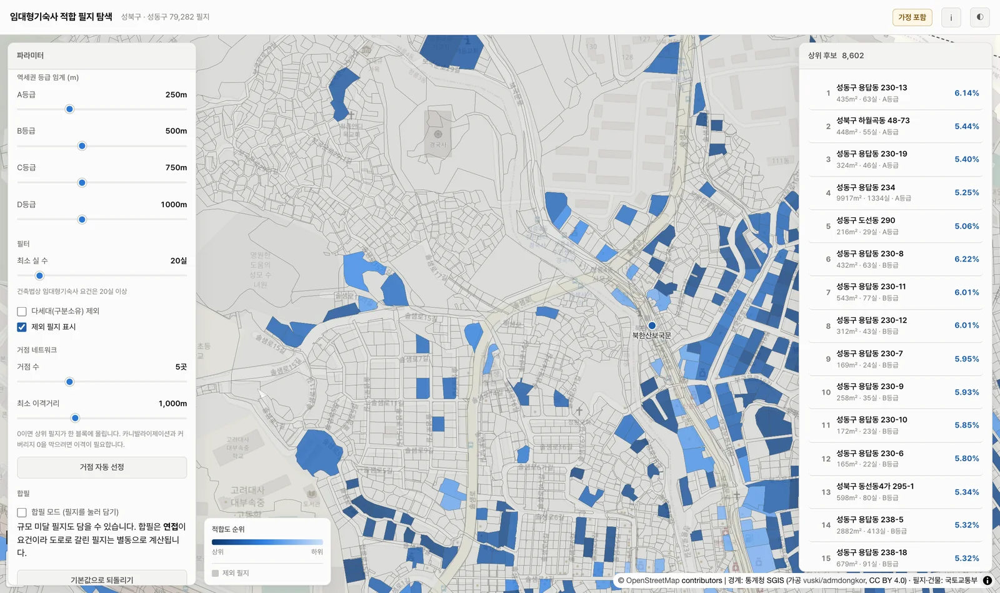

*회색이 제외된 필지. 클릭하면 제외 사유가 나옵니다.*

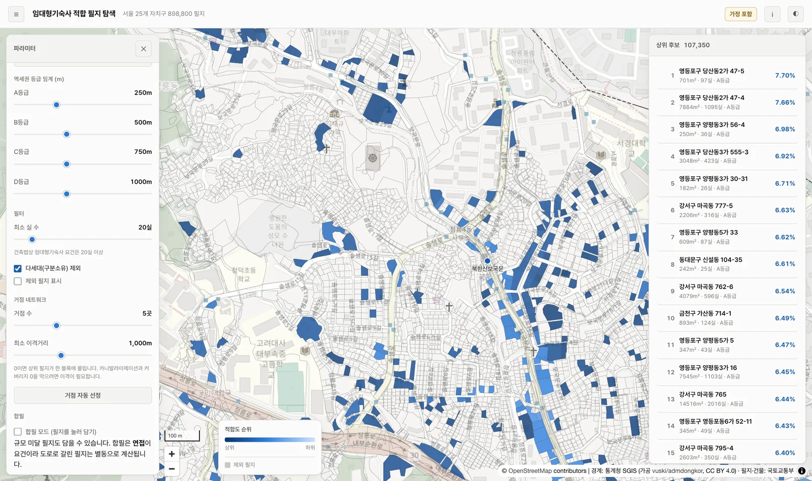

*구분소유 필지를 빼면 후보가 4,894에서 3,753으로 줄어듭니다.*

---

## 아키텍처

GitHub Pages에는 백엔드가 없는데 사용자는 파라미터를 실시간으로 조정해야 합니다.
이 둘을 동시에 만족시키는 구조는 하나뿐입니다.

> **점수를 미리 계산해서 굽지 않는다.**
> 정규화된 raw 지표값만 타일과 경량 JSON에 넣고, 최종 점수는 브라우저가 계산한다.

| 영역 | 선택 | 이유 |
|---|---|---|
| 분석 | Python + GeoPandas | 표준 공간분석 스택 |
| 좌표계 | EPSG:5186 분석 / 4326 출력 | 거리·면적은 미터 좌표계에서 |
| 타일 | PMTiles (20MB) + tippecanoe | 타일 서버 없이 정적 호스팅 |
| 지도 | MapLibre GL JS | 액세스 토큰 불필요, 과금 지점 없음 |
| 점수 | 브라우저 (`web/score.js`) | 재빌드 없이 파라미터 조정 |
| 배포 | GitHub Pages | 무료 |

전역 백분위 순위가 필요한데 벡터타일은 화면에 보이는 타일만 로드되므로,
후보가 될 수 있는 필지 27,857개의 raw 값을 `scoring.json`(2.5MB)으로 함께 싣습니다.
전체 재계산은 **7~8ms**입니다.

### 정확도가 용량보다 우선

타일 용량을 아끼려고 값을 정수로 절사했다가 웹이 조용히 틀릴 뻔했습니다.
실 수는 `floor()`, 역세권은 등급 경계로 끊기므로 입력이 조금만 어긋나면 결과가 한 칸씩 튑니다.

| 양자화 | S₁ 최대오차 | 실수 불일치 | 상위200 순서 |
|---|---|---|---|
| 공시지가 천원절사 + 실현계수 ×1,000 | **6.6%p** | 490 | **114/200** |
| ×10 / ×10,000 | 5.0e-03 | 19 | 200/200 |
| **×100 / ×100,000 (채택)** | 2.3e-07 | **0** | **200/200** |

파일은 17.0MB에서 20.1MB로 3MB 늘었을 뿐입니다.

---

## 검증

두 개의 검증 스위트가 있고, **한 항목이라도 실패하면 종료 코드 1**입니다.

```bash
python3 scripts/07_verify_tiles.py
```

```bash
node tools/verify_ui.mjs
```

`07_verify_tiles.py`

- 최대줌에 전 필지 52,970개 보존
- 속성 8종 원본과 왕복 일치
- 타일 + `meta.json` 만으로 S₁·실 수·후보판정·역세권등급 복원
- 계층 정렬 상위 200 집합·순서 일치

`verify_ui.mjs`

- **JS 점수 엔진이 Python과 같은 순위를 내는가 (상위 200 집합·순서 200/200)**
- 파라미터 상호작용, `tol=0` 회귀, 등급 임계 단조성
- 선택·상세 패널, 다크모드, WCAG AA 대비, em-dash 부재
- 390 / 820 / 1920px 반응형, 패널 겹침, 지도 가시영역

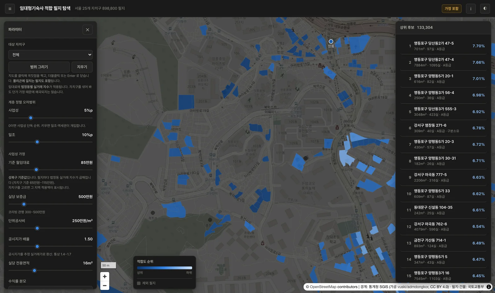

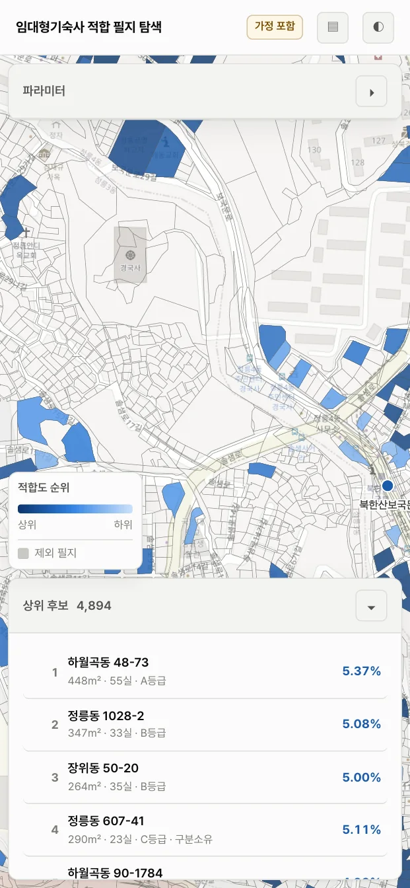

---

## 실행

```bash
uv venv && source .venv/bin/activate && uv pip install -r requirements.txt
```

```bash
brew install tippecanoe
```

분석 파이프라인은 순서대로 실행합니다.

```bash
cd scripts && for s in 01_build_parcels 02_metrics_s1 03_stations 04_solar 05_ranking 06_export_tiles 07_verify_tiles; do python3 $s.py; done
```

로컬 확인은 **Range 요청을 지원하는 서버**가 필요합니다.
Python 기본 `http.server`는 Range를 무시해 PMTiles가 동작하지 않습니다.

```bash
python3 tools/serve.py 8899 web
```

데이터 취득 경로는 [docs/DATA_SOURCES.md](docs/DATA_SOURCES.md)에 있습니다.
`data/`는 저장소에 포함되지 않습니다.

---

## ⚠️ 한계

**검증된 값**

용도지역·필지형상·지형·공시지가·접도조건 (토지특성정보 실측),
건물 높이·층수 (GIS건물통합정보), 용적률·건폐율 (서울시 도시계획조례 원문),
실당 임대료·보증금 (2026년 성북구 시세).

**아직 가정인 값**

단위공사비 250만원/㎡, 철거비 10만원/㎡, 전용률 0.65, 실당면적 16㎡,
공실률 0.05, 운영비율 0.25, 실거래배율 1.5, 실현계수 base 0.90.

이 값들을 실제 견적과 시세로 보정하기 전까지 **결과를 투자 판단에 그대로 쓰면 안 됩니다.**
웹 화면 상단의 "가정 포함" 배지는 이 사실을 알리기 위한 것입니다.

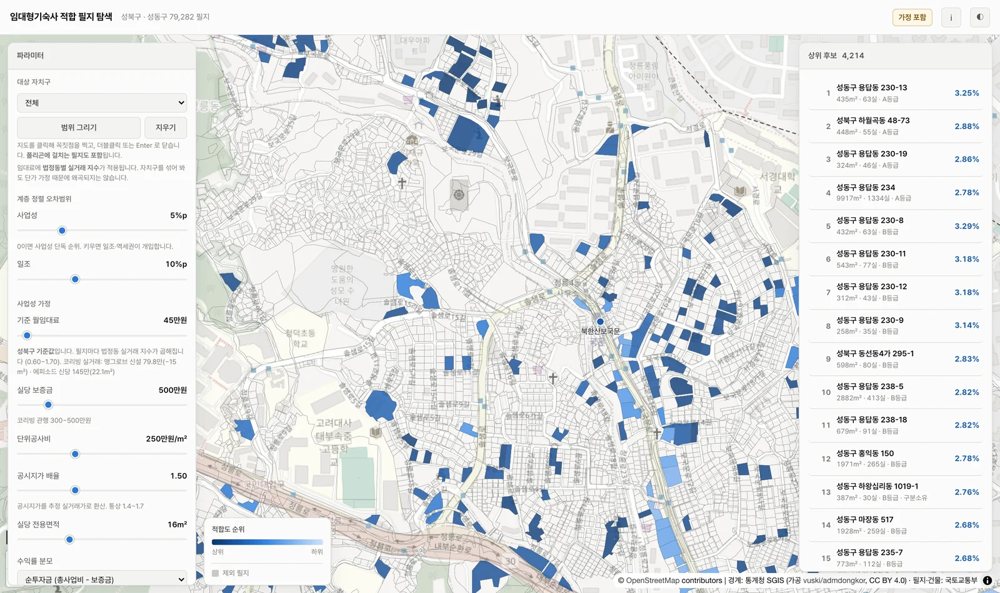

*임대료를 45만원으로 낮추고 최소 30실을 요구하면 후보가 크게 줄어듭니다.
가정 하나가 결과를 얼마나 흔드는지 직접 확인할 수 있습니다.*

**그 외**

- 일조 분석은 인접 건물의 기하학적 차폐만 봅니다. 일조권 사선제한 등 법적 심의는 반영하지 않습니다.
- 건물 40,368동 중 24.8%는 높이·층수가 모두 없어 바닥면적으로 추정했습니다.
- 역까지 거리는 직선거리입니다. 성북구는 구릉지가 많아 실제 도보거리보다 짧게 나옵니다.
- 상업지역 비주거 의무비율(연면적 10% 이상)과 1종일반주거 층수 제한은 미반영입니다.
- 동북선 경전철(2027년 11월 개통 예정)은 역명이 확정되지 않아 기본 제외입니다.

---

## 데이터 출처

| 데이터 | 출처 | 기준일 |
|---|---|---|
| 토지특성정보 (AL_D194) | 국토교통부 / 브이월드 | 2026-05-13 |
| 개별공시지가 (AL_D151) | 국토교통부 / 브이월드 | 공시일자 2026-04-30 |
| GIS건물통합정보 (AL_D010) | 국토교통부 / 브이월드 | 2026-08-09 |
| 지하철역 좌표 | 서울 열린데이터광장 | 2026-08-31 수집 |
| 행정경계 | 통계청 SGIS | 2026-07-01 |
| 배경지도 | OpenStreetMap | 실시간 |

행정경계는 통계청 통계지리정보서비스(SGIS)에서 공공누리 제1유형으로 개방한 자료를
가공한 것이며(가공: [vuski/admdongkor](https://github.com/vuski/admdongkor)), CC BY 4.0으로 배포됩니다.
배경지도는 © OpenStreetMap contributors.

## 문서

| 문서 | 내용 |
|---|---|
| [METHODOLOGY.md](docs/METHODOLOGY.md) | 지표 정의. 이 프로젝트의 사양서 |
| [DECISIONS.md](docs/DECISIONS.md) | 결정 로그와 그 근거 |
| [DATA_SOURCES.md](docs/DATA_SOURCES.md) | 데이터 카탈로그와 취득 경로 |
| [ROADMAP.md](docs/ROADMAP.md) | 작업 목록과 완료조건 |

## 라이선스

코드는 MIT. 데이터는 각 제공기관의 이용조건을 따릅니다.
